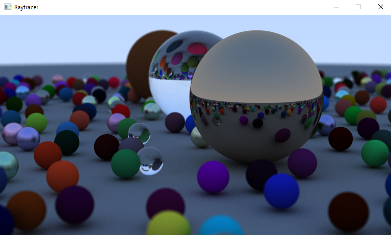

# RayTracing

A Raytracer project using C++ and SDL.

The project can be built using CMake.
On windows:
 - Download Visual Studio
 - Download SDL2 and place the `include` and `lib` folders inside `external`
 - Place the SDL.dll on the root folder
 - With CMake define the SDL2 includes to be the external folder
 - Generate and Open the solution on Visual Studio.
On Linux:
 - Install sdl2 (and g++) with `sudo apt install cmake libsdl2-dev g++`
 - Run `cmake .` on the root folder.
 - Run `make` on the generated Makefile, and then ./raytracer

Source:
[RayTracing in one weekend book](https://raytracing.github.io/)
